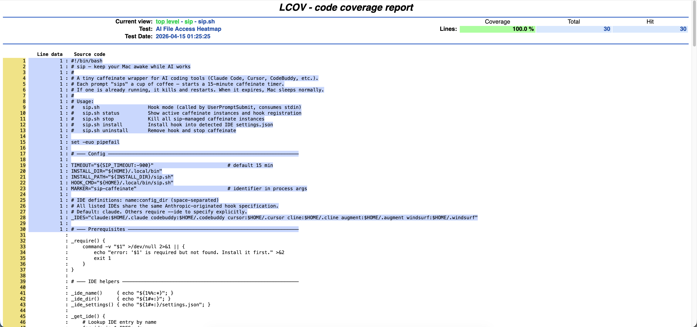
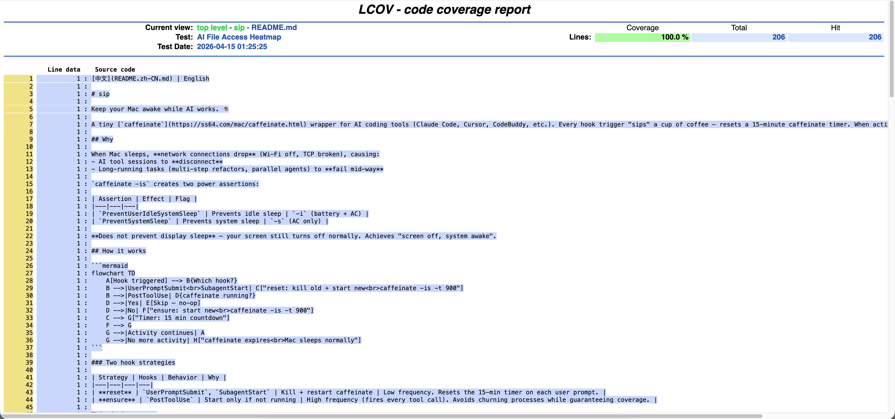
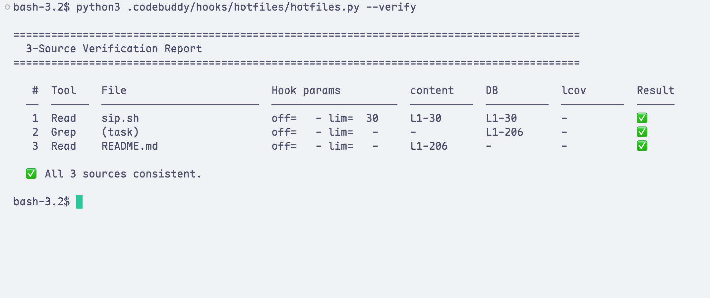

[English](README.md) | 中文

# hotfiles

追踪 AI 编码工具的文件访问行为（读取 + 搜索），导出 lcov，生成行级 HTML 热力图。

看看你的 AI 助手到底读了哪些文件、哪些行——以覆盖率风格的热力图可视化呈现。

## 为什么需要

使用 AI 编码助手（Claude Code / Cursor / CodeBuddy 等）时，你常常会好奇：
- AI 到底读了哪些文件？
- 它对代码的审查有多深入？
- 它是否遗漏了重要文件？

**hotfiles** 通过 `PostToolUse` hook 记录每一次 `read_file`、`search_content`、`codebase_search` 等工具调用，存入 SQLite，再使用 [lcov](https://github.com/linux-test-project/lcov) / `genhtml` 生成可视化热力图。

## 工作原理


追踪范围：`read_file` · `Read` · `search_content` · `Grep` · `search_file` · `codebase_search` · `task`/`Task`（子代理内部调用）

### 支持的 IDE

| IDE | 配置目录 | Hook 格式 |
|---|---|---|
| [Claude Code](https://docs.anthropic.com/en/docs/claude-code) | `.claude/` | ✅ 相同 |
| [CodeBuddy](https://www.codebuddy.ai/) | `.codebuddy/` | ✅ 相同 |
| [Cursor](https://cursor.com/) | `.cursor/` | ✅ 相同 |
| [Cline](https://docs.cline.bot/) | `.cline/` | ✅ 相同 |
| [Augment](https://www.augmentcode.com/) | `.augment/` | ✅ 相同 |
| [Windsurf](https://docs.windsurf.com/) | `.windsurf/` | ✅ 相同 |

所有 IDE 使用相同的 Anthropic hook 规范。`install.py` 自动检测使用哪个。也可通过 `--ide` 手动指定。

## 前置依赖

- Python 3.8+
- [`lcov`](https://github.com/linux-test-project/lcov)（生成 HTML 用）：`brew install lcov`

## 快速开始

```bash
# 克隆仓库
git clone https://github.com/tivnantu/hotfiles.git

# cd 到你的项目，然后安装
cd /path/to/your/project
python3 /path/to/hotfiles/install.py

# 开启新的 AI 会话，正常写代码…

# 生成热力图
python3 .claude/hooks/hotfiles/hotfiles.py --html --open
```

安装脚本会自动检测 IDE。也可以手动指定：

```bash
python3 install.py --ide cursor
python3 install.py --ide codebuddy
python3 install.py --ide claude       # 默认
```

## 使用方式

### install.py

从 **hotfiles 仓库** 运行，目标是你的项目：

```bash
python3 install.py                      # 安装（自动检测 IDE）
python3 install.py --ide cursor         # 指定 IDE
python3 install.py --project /path/to   # 指定项目目录
python3 install.py --debug              # 开启 debug 日志
python3 install.py --status             # 查看状态
python3 install.py --uninstall          # 卸载
```

### hotfiles.py

从你的**项目**中运行（安装时自动部署）：

```bash
# 无参数 = hook 模式（PostToolUse 自动调用）
python3 hotfiles.py

# 手动导出
python3 hotfiles.py --export       # 仅导出 lcov
python3 hotfiles.py --html         # 导出 + 生成 HTML
python3 hotfiles.py --html --open  # 导出 + 生成 + 打开浏览器
python3 hotfiles.py --verify       # 三源校验
```

## Debug 与校验

安装时加 `--debug` 记录原始 hook JSON：

```bash
python3 install.py --debug

# 跑完会话后：
python3 hotfiles.py --export    # 先导出 lcov
python3 hotfiles.py --verify    # 三源校验：debug log vs DB vs lcov
```

关闭 debug：重新 `install.py`（不带 `--debug`）即可。

## 效果展示

行级热力图——精确查看 AI 读了哪些行：





### 三源校验报告（`--verify`）



## 设计决策

### 为什么用 lcov？

lcov 是 Linux 标准代码覆盖率格式。`genhtml` 能生成漂亮的交互式 HTML 报告，带文件树、行高亮和命中计数——完全免费，无需自定义前端。

### 为什么用 SQLite？

- WAL 模式支持多个 hook 调用并发写入
- 零配置、零依赖（Python 标准库）
- 可查询——你可以对 `hotfiles.db` 执行自定义 SQL 深入分析

### 为什么按项目安装？

每个项目有自己的 `hotfiles.py` + `hotfiles.db`：
- 数据按项目隔离
- 多项目互不干扰
- 清理简单：`rm -rf .claude/hooks/hotfiles/`

### 行范围提取优先级

记录访问了哪些行时，hotfiles 使用 6 级优先级链：
1. `offset + limit`（最精确）
2. `offset + content 末行`（IDE 可能丢失 limit）
3. `content 首行 + limit`（IDE 可能丢失 offset）
4. `content 首末行`（两者都缺失）
5. `1 ~ limit`（保守推断，无 content）
6. `1 ~ totalLineCount`（全文件读取）

这套逻辑处理了不同 IDE 工具响应格式的各种差异。

## 文件说明

```
hotfiles/
├── hotfiles.py     # 核心：hook 处理 + lcov 导出 + HTML 生成
├── install.py      # 安装器：多 IDE 支持，自动检测
├── .gitignore
├── README.md       # English
├── README.zh-CN.md # 中文
└── LICENSE
```

安装后（以 Claude Code 为例）：
```
your-project/
└── .claude/
    ├── settings.json              # 注册了 PostToolUse hook
    └── hooks/hotfiles/
        ├── hotfiles.py            # 部署的副本
        ├── hotfiles.db            # 首次会话后创建
        ├── hotfiles.lcov          # --export 创建
        └── hotfiles_html/         # --html 创建
```

## License

[MIT](LICENSE)
